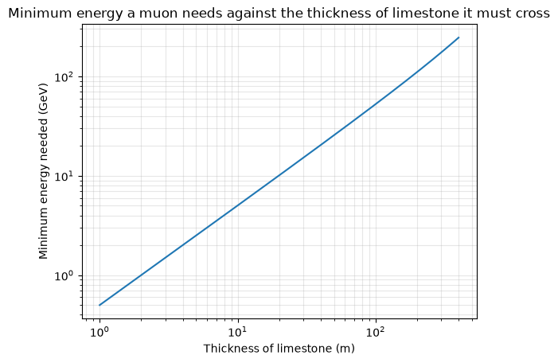

## Week 01 — 20/09/2026-27/09/2026

**What I did**

I read the entire guide provided by Mr Kim, and started to go through muography.py file to understand the parameters of the functions. I finished week 1 notebook, with a few misunderstandings on the parameters. I had to look up how to use github in a group repository.

**What I found**

The graph increases linearly. Showing that the minimum energy needed is linear to the thickness of the limestone.

**What went wrong / what I don't understand**

I forgot to convert degrees to radian for the angle in the surviving flux against limestone thickness graph causing the graph results to be inverted.

**Next week I plan to**

Plot the surviving flux against limestone thickness from 1 m to 400 m.
Check through the graphs

**Hours spent:** 4


