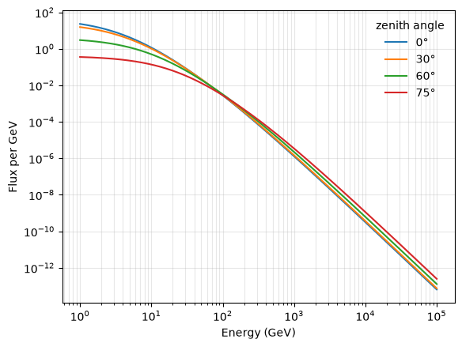

# Weekly log

Copy this into a new file each week: `logs/week01.md`, `logs/week02.md`, and so
on. Send it before the meeting. Ten minutes, four short paragraphs, no polish
required.

An honest log saying "I lost four hours to an indexing bug and still have not
found it" is more useful to your mentor than a tidy one that hides the week. The
stuck weeks are where supervision actually helps.

---

## Week 2 — 28/9/2026-4/10/2026

**What I did**

I plotted the surviving flux against limestone thickness from 1 m to 400 m.
After consulting Mr Kim during the meeting, I tried to integrate the flux for the surviving flux against limestone thickness graph. 
I also looked in further onto why the zenith flux at 0 degrees has higher energy than larger angles at high flux but lower energies than larger angles at low flux.

**What I found**

In the lower, denser regions of the atmosphere, high-energy mesons often collide before they can decay due to the high density.
⁠But at large zenith angles, due to the thinner atmosphere, mesons travel through air that is less dense. Thus having more space and time to decay before collision with an air nucleus causing it to lose energy.

**What went wrong / what I don't understand**

The surviving flux against limestone thickness graph I had initially plotted had each angle plotted on a separate curve instead of integrated into one curve. I could not find how to integrate it into once curve.

*(The most important section. Be specific: which cell, which number, what you
expected versus what you got. "It doesn't work" cannot be helped; "the opacity
comes out negative when ay is above 30 degrees" can be helped in two minutes.)*

**Next week I plan to**
 
Read through the papers provided.
Plot the opacity for the target.

**Hours spent: 2** ___
